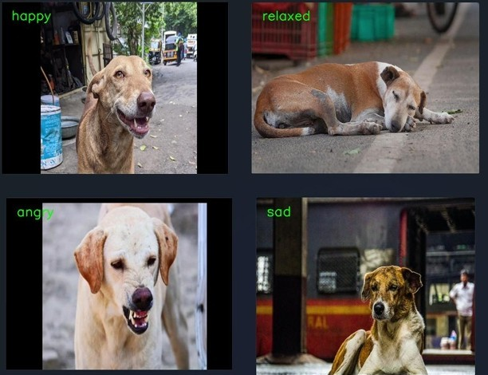

# Dog Emotion Detection Project

## Overview

This project aims to detect the emotions of dogs from images using computer vision and deep learning techniques. It utilizes a Convolutional Neural Network (CNN) model, specifically MobileNet, to classify dog facial expressions into predefined emotion categories.

## Features

* **Image-based Emotion Recognition:** Classifies dog emotions from static images.
* **Real-time Emotion Detection:** Detects dog emotions from a live video feed using a webcam.
* **Haar Cascade for Face Detection:** Employs Haar cascades for efficient dog face detection.
* **Transfer Learning:** Leverages the MobileNet architecture pre-trained on ImageNet for improved performance.
* **Data Augmentation:** Implements data augmentation techniques to enhance model robustness and generalization.
* **Kalman Filter:** Includes a Kalman Filter to smooth bounding box coordinates in real-time detection.
* **Categorical classification**: Classifies dog emotions into four categories: angry, happy, relaxed, and sad.

## Files

* `dog_emotion_model.h5`: Trained Keras model for dog emotion recognition.
* `dog_emotion_recognition.ipynb`: Jupyter Notebook containing the code for training, testing, and evaluating the emotion recognition model.
* `haarcascade_frontalface_default.xml`: Haar Cascade XML file for dog face detection.
* `model_test.ipynb`: Jupyter Notebook for testing the trained model.
* `image.jpg`: Example image for testing the model.

## Dependencies

* Python 3.x
* TensorFlow 2.x
* Keras
* OpenCV (cv2)
* NumPy
* Pandas
* Seaborn
* Matplotlib
* Scikit-learn

## Installation

1.  Clone the repository.
     ```bash
       https://github.com/chetankumarpulipati/animal-emotion-detection.git
     ```
2.  Install the required dependencies using pip:

    ```bash
    pip install tensorflow opencv-python numpy pandas seaborn matplotlib scikit-learn
    ```

## Usage

### Training and Evaluation

* Run the `dog_emotion_recognition.ipynb` notebook to train and evaluate the model.

### Real-time Emotion Detection

1.  Ensure you have a webcam connected.
2.  Run the python script, ensuring all dependencies are installed.
3.  The script will capture video from your webcam, detect dog faces, and display the predicted emotion in real-time.
4.  Press 'q' to quit.

### Testing

* Run the `model_test.ipynb` notebook to test the pre-trained model on images.

## Model

* The model is based on the MobileNet architecture, fine-tuned for dog emotion recognition.
* Transfer learning is used to leverage pre-trained weights and improve performance.
* The model is trained to classify dog emotions into four categories: angry, happy, relaxed, and sad.

## Results

* The model achieves reasonable accuracy on the dog emotion recognition task.
* Further improvements can be made by increasing the size and diversity of the training data, experimenting with different model architectures, and fine-tuning hyperparameters.



## Future Work

* Explore more advanced face detection methods, such as MTCNN or YOLO.
* Improve the accuracy and robustness of the real-time emotion detection.
* Expand the number of detectable dog emotions.
* Deploy the model to a web application or mobile app.
* Investigate methods for handling variations in dog breeds and poses.
